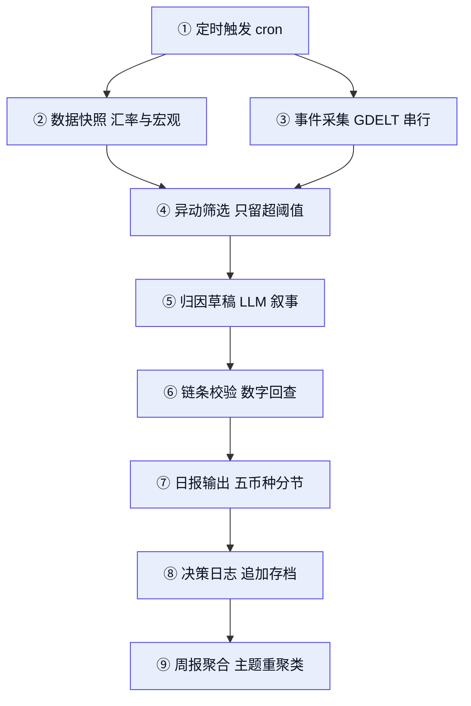

# 五币种(USD/PHP/BRL/THB/EUR)宏观日报生成 Skill 方案调研报告

**日期**: 2026-08-10 | **方法**: Claude Research (super-research) | **模式**: Standard(7 子代理并行检索 + 端点实测)

## Executive Summary

- **数据侧已闭环,且经端点实测验证**:Frankfurter 免费汇率 API(无 key、无配额、开源可自托管,"tracks daily exchange rates from 84 central banks, covering 201 currencies back to 1948")实测一次调用返回当日 USD 兑 PHP/THB/BRL/EUR 全部四对汇率 [自测 2026-08-10] [1];事件侧 GDELT DOC 2.0 免费 API 实测打通"昨日事件→币种"链路(昨日窗口直接命中 2026-08-09 菲律宾比索走弱的本地报道)[自测 2026-08-10] [17]。
- **最大缺口是免费合规的经济日历 API,且已确认无解**:Finnhub 日历端点无 key 实测返回 HTTP 401 [自测 2026-08-10] [11],且其官方文档已将 Economic Calendar 标注为 Premium 付费端点 [11];TradingEconomics 与 FXStreet 的日历 API 均为付费/授权产品 [12][13],开源侧几乎全靠 ForexFactory/investing.com 爬虫,存在反爬与 ToS 风险 [37][49][50]。
- **没有现成的"多币种 FX 宏观日报"开源轮子**:头部金融 LLM 管线(TradingAgents、FinRobot、gpt-researcher、DeepEar)全部是股票 ticker 导向,PHP/THB/BRL 无现成覆盖,且均无内置每日定时调度——skill 需自行组装,但每个环节都有高质量借鉴对象 [28][29][30][31]。
- **"五种法币的投资建议"需要重新定位**:学术共识是短期汇率预测跑不赢随机游走(Meese-Rogoff 之谜),2025 年针对新兴经济体(巴西)的研究仍印证该结论 [38][39];建议把日报定位为"事件解读 + 风险提示 + 触发条件",而非方向性预测。
- **"完整叙事逻辑链条"有成熟范式可抄**:ING FX Daily 的三段链条(事件→央行/市场定价含义→明确汇率区间)与 Agility 的公式化模板(实际 vs 预期 vs 前值 + 支撑阻力位)可直接移植为 LLM 报告模板 [21][23];周报的正确形态是"按主题重聚类日事件"而非流水账 [22][24]。
- **形态参照**:claude-trading-skills(高星且 AS_OF 当天仍有 push [自测 2026-08-10])证明"Claude skill + 日/周/月分层工作流 + 本地定时调度"这一目标形态已有活跃先例 [32]。

## 1. 推荐技术栈速览 [confidence: high]

| 环节 | 首选 | 备选/补充 | 关键依据 |
|------|------|-----------|----------|
| 汇率行情 | Frankfurter(无 key、无配额、MIT 可自托管)[1][2] | exchange-api(CC0 静态 CDN、338 币种 [自测 2026-08-10])[4];ExchangeRate-API Open(带 time_next_update 调度锚点)[3] | 三者实测均覆盖五币种;Frankfurter 唯一"当日 date + 维护活跃 + 可自托管"全满足 [自测 2026-08-10] |
| 宏观指标 | DBnomics(单点聚合,实测 93 家提供方)[5][6] | FRED(release dates 判定"昨天发布了什么")[7];BCB SGS/PTAX(BRL 一手)[8] | 菲/泰仅 IMF 口径间接覆盖,见 §2.2 |
| 事件/新闻 | GDELT DOC 2.0 API(免费、跨 65 语言)[17] | GDELT Cloud(付费,MCP + 事件级市场敏感度指标)[18] | 实测限速 5 秒/次,必须串行,见 §2.3 |
| 经济日历 | **免费 API 缺口已坐实**(Finnhub 文档标 Premium [11]):v1 用央行/统计局静态年历 + FRED release dates [7] | TradingEconomics API(付费,覆盖 PH/TH/BR)[12];MCP 爬虫包装(合规风险自担)[35][36] | 见 §2.4 与 Key Controversies |
| 管线形态 | 自建 skill,借鉴 claude-trading-skills 的 manifest + 日/周分层 [32] | gpt-researcher(报告聚合)、TradingAgents(链条)、FinRobot(数字/叙事分离)、DeepEar(逻辑链模板)[28][29][30][31] | 只抄架构与模板,不引代码,见 §3 |
| 定时调度 | cron / GitHub Actions / launchd(skill 外挂) | — | 头部管线均无内置调度 [28][29][30][31] |

## 2. 信息获取途径盘点 [confidence: high]

### 2.1 汇率行情:已解决

Frankfurter 是最强候选:"The public API lives at api.frankfurter.dev. It requires no API key"、"There are no quotas",商用免费、MIT 开源可 Docker 自托管,并原生提供 llms.txt 与 MCP server [1][2]。实测 `GET /v2/rates?base=USD&quotes=PHP,THB,BRL,EUR` 返回 date=2026-08-10 的 BRL 5.1052 / EUR 0.866 / PHP 60.843 / THB 33.056,五币种一次调用齐返 [自测 2026-08-10] [1]。其 `group=week|month` 降采样参数可直接服务周报,`providers=` 参数可切换到单一央行官方参考价 [1]。仓库维护活跃:最近 push 2026-07-23,v2.3.5 发布于 2026-06-25 [自测 2026-08-10] [2]。

备选双源:
- **exchange-api**(CC0,纯静态 CDN,README 自述 "200+ Currencies ... No Rate limits ... Daily Updated"):实测 currencies.json 共 338 个币种键,php/thb/brl/eur/usd 全在列;`@latest` 返回 date=2026-08-09,滞后一天——恰与"前一天"日报口径咬合,但应使用版本化日期端点并按 README 要求配 Cloudflare 兜底 URL [自测 2026-08-10] [4]。注意代码仓最近 push 2026-05-22,单人维护,数据发布管线独立存活 [自测 2026-08-10] [4]。
- **ExchangeRate-API Open Access**:无 key、每日一刷、要求页面署名;响应含 `time_next_update` 字段可作调度锚点;注册 Free 档 "1.5k Requests p/m" 免署名,限流后 429、"After 20 minutes the rate limit will finish";Pro 档 "$10/mo ... Updates Every 60 Minutes / 30k Requests p/m" [3]。
- 选型时避开常见坑:部分免费档锁定基准货币(Open Exchange Rates 锁 USD、Fixer 锁 EUR)[15],免费 API 普遍存在低额度/隔夜缓存问题 [46]。

**建议:Frankfurter 为主、exchange-api 为异源交叉校验**(后者汇率上游口径未公开,双源比对可发现异常)。

### 2.2 宏观经济数据:BRL 强、PH/TH 靠兜底

- **DBnomics**:聚合多家官方统计机构、"Daily Automatic Updates ... updated as soon as providers publish"、保留全部历史修订版本(数据修正本身可作为叙事事件),并提供 llms.txt [5]。实测 v22 providers 端点共 93 家,**含巴西央行 BCB,但无菲律宾央行 BSP 与泰国央行 BOT**;"Philippines consumer price index" 命中 12 个数据集、"Thailand policy rate" 命中 2 个,均为 IMF/ILO 口径的月度间接数据 [自测 2026-08-10] [6]。
- **FRED**:免费需注册 key;对本方案最有价值的是 releases/dates 端点族("Get release dates for all releases of economic data"),可程序化判定"昨天发布了哪些数据";World Bank 标签可补五经济体低频指标 [7]。
- **BCB(巴西央行)**:开放 SGS 时间序列与 PTAX 官方汇率,无 key、每日更新,是五币种中官方数据最易机读的一家 [8]。
- **BOT(泰国央行)**:有统计门户 [9];更关键的一手证据来自 Frankfurter 仓库 README,其可选数据提供方逐字列出 "`BOT_API_KEY` — Bank of Thailand. Register at portal.api.bot.or.th",证实 BOT 有官方 API 门户且免费注册 [2]——自托管 Frankfurter 时可直接挂 BOT/FRED 官方源。
- **BSP(菲律宾央行)**:仅确认统计门户存在 [10],机读 REST/SDMX 接口本轮未获一手证据,是五经济体中最弱一环(兜底:DBnomics 的 IMF 序列 [6] + GDELT 事件流,见事件章节)。
- **akshare**(两万余星,中文生态最大的财经数据接口库 [自测 2026-08-10]),但其外汇章以人民币汇率中间价为中心,五币种交叉盘覆盖未确认,不宜作为本方案主数据源 [14]。

### 2.3 事件与新闻:GDELT 免费打通,但要按"线索发现"用

GDELT 免费开放、监控 100+ 语言全球新闻、300+ 类 CAMEO 事件编码、"live datasets updated every 15 minutes" [16]。对日报管线,正确入口是 **DOC 2.0 API**(免费无 key):机器翻译覆盖 65 种语言("98.4% of GDELT's daily non-English monitoring volume"),按英文关键词即可命中菲语/泰语/葡语本地报道,滚动窗口最近 3 个月,支持 JSON、tone 情绪直方图与声量时间线,并有现成 Python 客户端 gdeltdoc [17][20]。实测以 "Philippine peso" 为关键词、昨日窗口检索,直接返回 2026-08-09《Philippine peso weakens on economic slowdown concerns》的菲律宾本地报道 [自测 2026-08-10] [17]。

三条工程纪律:
1. **串行限速**:实测连续第二次请求即返回 "Please limit requests to one every 5 seconds"——HTTP 200 但正文是限速提示的软失败形态,重试逻辑必须识别正文 [自测 2026-08-10] [17]。
2. **不要批量拉原始事件表**:仅 2015 年 GKG 数据即 "over 2.5TB" [16];日报应按币种关键词做小规模检索,再让 LLM 读原文 URL 归因,而非消费事件编码行——GDELT 机器编码存在错误率,ONS 方法论附录专门列出实际不准确案例,原始事件行只能当"线索"而非"事实" [16][19]。
3. **升级路径**:GDELT Cloud(2026 年推出的第三方商业层)提供去重 Stories、实体链接、market_sensitivity 等事件级指标、MCP server 与面向 agent 简报的 "Brief Output Format" 指南,"Data updates every hour";但历史数据 "spotty before March 2026" 且需付费 key,厂商自述、定价未验证 [18]。

### 2.4 经济日历:唯一未闭环的环节

"前一天发生的事件"有两类:突发新闻(GDELT 已覆盖)与**日历型数据发布**(CPI/议息/非农的实际值 vs 预期值)。后者的免费合规获取仍无解:

| 途径 | 状态 | 证据 |
|------|------|------|
| Finnhub Economic Calendar | 无 key 实测 HTTP 401;官方文档侧边栏将 Economic Calendar 标注为 Premium 付费端点,免费档不可用 [自测 2026-08-10] | [11] |
| TradingEconomics Calendar API | 付费/授权产品,但覆盖 PH/TH/BR 等新兴市场,是覆盖面最全的日历源 | [12] |
| FXStreet Calendar API | 面向授权客户 | [13] |
| ForexFactory/investing.com 爬虫 | 开源生态主流做法,但 FF 有 Cloudflare 反爬(抓取者实测 503 + 检查页)、ToS 风险自担,商业化 scraper 也只敢承诺"合理限速" | [37][49][50] |
| 日历 MCP 包装 | 已出现把 ForexFactory 与 TradingEconomics 日历包成 MCP server 给 LLM 用的小型仓库,形态正确但上游仍是爬虫/付费源 | [35][36] |

网页抓取的合规边界本身是灰色地带(公开数据抓取合法性依辖区与 ToS 而异)[48]。**建议(定案)**:免费合规的日历 API 不存在——v1 用"央行会议日程 + 官方统计局发布日程"的静态年历(官网公开 PDF/页面,低频人工维护)+ FRED release dates [7] 覆盖 US/EU,PH/TH/BR 数据发布靠 GDELT 事后捕捉;付费方案唯一推荐 TradingEconomics [12]。另注意:免费管道拿不到"市场共识预期值"——日报模板中的"实际 vs 预期"要么由 LLM 从当日新闻文本中抽取记者引用的共识数字(专业日评正文通常包含此类数字 [21]),并标注转引来源;要么降级为"实际 vs 前值"。

## 3. 开源项目借鉴:抄什么、不抄什么 [confidence: high]

高星生态与本需求错位:forex 关键词下星标最高的是交易/回测引擎(nautilus_trader、Lean 等),与日报叙事生成无关;真正可借鉴的项目要靠影响力扫描 + awesome-list 交叉才能找全 [34]。

| 项目 | 星标(2026-08-10 快照) | 借鉴什么 | 不抄什么/风险 |
|------|------|----------|----------------|
| TradingAgents [28] | 96.9k★ | Apache-2.0;"分析师团队→多空结构化辩论→Trader 汇总→风控→终审"的叙事链条骨架;decision log 记忆(每日决策追加存档,次日取实际回报生成反思注入 prompt)——正是"周报回顾日报结论"的现成机制 | 单 ticker 股票导向,FX 对支持未证实;LangGraph 全栈过重,只抄架构 |
| FinRobot [29] | 7.8k★ | 核心纪律 "Numbers are code-calculated. Narratives are LLM-assisted. Every output is provenance-tracked";"1 Lead Agent + 5 role-based sub-agents + 3 debate agents" 编排;"分析产物落盘→报告渲染"两段式 | "~184k lines" 体量,equity 研报导向;只抄"数字/叙事分离"原则 |
| gpt-researcher [30] | 28.9k★ | planner/execution 双层报告聚合;可装成 Claude Skill(`npx skills add`);deep research 成本锚点 "~5 minutes ... ~$0.4 per research" | 无金融叙事结构;"exceeding 2,000 words" 长文倾向与"简明扼要"相反,需强模板约束 |
| DeepEar [31] | 270★ | 唯一把"投资逻辑传导链"作为一等公民:ISQ 评分模板、传导链图、跨日 Logic Evolution Tracking(`--update-from` 增量追踪论点演变) | 中文 A 股舆情导向,15+ 新闻源需全部替换;单人维护(pushed 2026-04-16,69/69 commits,零 release [自测 2026-08-10]),抄概念不引代码 |
| claude-trading-skills [32] | 2.6k★ | 与目标产物完全同构的形态参照:skills/ + workflows/ 机器可读 manifest、"15-minute daily market check" 日/周/月分层、launchd 定时调度目录、"No API Key Starter Path" 零付费依赖路径;维护最活跃(pushed 2026-08-10 当天,694 commits [自测 2026-08-10]) | 内容全部面向美股,FX/宏观叙事为零,内容层需全新编写 |
| daily-watchlist [33] | — | "每日汇集宏观数据生成结构化报告"的最小 Claude Code 工作流样板 | 小型单人项目,只当模板抄 |
| OpenBB / Vibe-Trading [34] | 71.7k★ / 30.5k★ | 数据平台级备选:OpenBB 定位 "Open Data Platform for analysts, quants and AI agents";Vibe-Trading 的 "5-source auto-fallback data layer"与 "7 backtest engines ... 17-tool MCP server" 展示了数据降级链设计 | 依赖重;均非日报叙事导向 |
| FinanceToolkit 等 [34] | — | awesome-quant 收录的宏观数据层工具("50+ macro indicators") | 无叙事能力 |

两个跨项目结论:
1. **无内置调度**:四个头部管线全部按需触发,每日节奏需外加 cron/GitHub Actions;claude-trading-skills 的 launchd 目录是 skill 生态的局部反例(外挂调度配置)[28][29][30][31][32]。
2. **若只能选一个蓝本**:形态抄 claude-trading-skills [32],叙事链条抄 TradingAgents 的"分析→辩论→结论"[28] + FinRobot 的数字/叙事分离 [29],逻辑传导图与逐日演化抄 DeepEar 概念 [31],报告聚合工程抄 gpt-researcher [30]。

## 4. 叙事逻辑链条与日报/周报结构 [confidence: medium]

专业机构的 FX 日评已经把"叙事逻辑链条"模板化,可直接移植:

**ING FX Daily 三段链条**(按币种分节:USD/EUR/CAD/CEE)[21]:
1. 驱动识别:"short-term rate differentials have become increasingly the predominant driver of USD moves"
2. 事件 → 定价含义:NFP 预测 70k(共识 80k)、失业率升至 4.3%;"Pricing has been remarkably stable at 14-17bp since the July FOMC"
3. 明确结论 + 区间:"we expect EUR/USD to stick to a 1.150-1.155 range ... 1.16 one-month and 1.18 year-end targets"
另有一个可量化的巧思:用历史事件反应幅度校准重要性——"EUR/USD has moved on average 0.2% in the hour after the NFP release. The past two prints both saw moves of 0.4%" [21]。

**Agility 公式化模板**(自动化程度更高)[23]:每币对固定字段(NY open / overnight range / close)+ 一段事件归因 + 支撑阻力位;数据点全部带对照——"Headline CPI would rose 2.4% y/y (forecast 2.5%, previous 2.3%)",叙事由"实际 vs 预期"差值驱动。这套结构比银行长文更适合程序化生成。

**新兴市场货币的结构性差异** [confidence: medium]:PHP/THB/BRL 的叙事链条必须双线并行——本国事件线(央行会议、通胀、政局)+ 美元/全球风险情绪外生线;BIS 研究表明 EM 汇率与本币债市资本流动存在"贬值→抛售→再贬值"放大机制 [27],ING 实践也是把 EM 按区域分册并与美元主题挂钩(FX Talking 月度分 G10/EMEA/Latam/Asia)[22]。ING 的 CEE 节写法(央行会议→利率市场重定价→汇率区间→下一个催化剂)可直接移植到 BSP/BOT/BCB [21]。

**周报 = 主题重聚类,不是日报串联**:Capital Economics FX Markets Weekly Wrap 与 ING 周期性产品的通用结构是"本周主导主题一句话 + 各币种一周走势归因 + 下周前瞻"——把每日事件按主题重新聚类,这正是"避免流水账"的结构性解法 [24][22]。中文范例可参照中国银行每日"汇市观察"(官方、每日更新)[25]。学术上,"把每日海量资产变动压缩成简明市场评论"(Market Commentary Generation)已被形式化定义并算法化求解 [26]。

## 5. Skill 方案蓝图 [confidence: medium]

综合以上证据,建议的日报管线(每日一次,UTC 00:30 后触发——此时 ExchangeRate 类源已完成零点刷新 [3],GDELT 的"昨日"窗口完整):

各环节要点(文本版,与图等价):

| 环节 | 做法 | 依据 |
|------|------|------|
| ② 数据快照 | Frankfurter 一次调用取五币种 [1];exchange-api 版本化端点异源校验 [4];DBnomics/FRED/BCB 取宏观增量 [6][7][8] | §2.1-2.2 |
| ③ 事件采集 | GDELT DOC 2.0 按 5 组币种关键词查询 timespan=24-48h,串行 sleep≥5s,取 tone + top 文章;LLM 读原文归因,不消费原始事件编码 [17][19] | §2.3 |
| ④ 异动筛选 | 只有超阈值变动(汇率日变动、宏观数据 vs 前值、事件声量突增)才进入叙事——"简明扼要、只要关键信息"的结构性保障 | 用户约束 |
| ⑤ 归因草稿 | 按 ING 三段链条模板逐币种成文:事件→定价含义→区间观点 [21];EM 币种双线并行 [27] | §4 |
| ⑥ 链条校验 | FinRobot 纪律:所有数字来自 API 落盘的 CSV,LLM 只写叙事 [29];LLM 会把最简单的汇率换算方向搞反(Gemini 实例)[43],数字回查是硬门 | §3 |
| ⑦ 日报输出 | 五币种分节 + 执行摘要;投资建议以"情景 + 触发条件 + 风险提示"表述(见 Controversies);附免责声明 | §4 |
| ⑧ 决策日志 | TradingAgents decision log 模式:当日结论追加存档,次日对照实际走势生成一段反思 [28];DeepEar 的跨日论点演化追踪作为进阶形态 [31] | §3 |
| ⑨ 周报聚合 | 读取 7 份日报 + 决策日志,按主题重聚类(而非按日罗列),输出"本周主线 + 各币种归因 + 下周前瞻 + 本周结论复盘" [24][22];Frankfurter `group=week` 直接取周频汇率 [1] | §4 |

**降级链(必须内置)**:免费 API 有无预告停服前科(Yahoo Finance API 2017 年 "Without prior announcement, Yahoo has abandoned" [45]),每类数据都要有备源:汇率 Frankfurter→exchange-api→ExchangeRate-API;宏观 DBnomics→FRED/BCB 直连;事件 GDELT→央行 RSS。Frankfurter 可自托管这一点本身就是终极对冲 [2]。

**skill 文件组织**(仿 claude-trading-skills [32]):`skills/`(fx-daily-report、fx-weekly-report、data-fetch 各自独立)+ `workflows/` 机器可读 manifest(命名每步用到的 skill、决策门与产物)+ 调度外挂(cron/GitHub Actions/launchd)。

## Key Controversies

- **方向性预测 vs 随机游走**:用户需求中的"五种法币的投资建议"若隐含短期方向预测,与 Meese-Rogoff 之谜的学术共识直接冲突——"'atheoretical' models, especially the random walk ... perform better than those that consider economic fundamentals",2025 年巴西研究仍成立 [38][39]。本报告的解法:建议输出"事件解读 + 情景 + 触发条件"(如"若今晚 CPI 高于预期,则比索承压至 X 区间"),明确不做无条件方向预测。ING 类机构给出区间与目标位,但那是有交易台与研究团队背书的机构观点 [21],LLM 日报不应模仿其确定性口吻。
- **叙事链条 vs 马后炮**:"完整且明确的叙事逻辑链条"这一需求本身有系统性风险——narrative fallacy 与 hindsight bias 结合,会对随机波动制造看似合理的因果解释 [confidence: low,单一 T4 来源] [47];买方白皮书同样警告 LLM 投资建议的迎合性("confirmation bias dressed up as investment advice")[40]。对冲手段:⑧ 决策日志的次日复盘(叙事被实际走势检验)[28] + 允许日报写"昨日波动无明确驱动"。
- **LLM 幻觉与合规**:幻觉率在下降("from nearly 38% in 2021 to about 8.2% in 2026 ... as low as 0.7%")但日报每天生成,残余错误率必然累积成季度级事故 [41];金融场景幻觉直接构成合规风险 [42];HN 社区对 AI 理财建议的祛魅(被认为"好"的建议实为通用保守套话)[44]。对冲:数字全部 API 落盘、LLM 只叙事 [29] + 免责声明。
- **免费日历数据的合规灰区**:开源生态的日历获取几乎全靠爬虫,ForexFactory 有 Cloudflare 反爬实证 [49],商业 scraper 与工具包只把 ToS 责任推给用户 [50][37],抓取合法性依辖区与条款而异 [48]。本方案 v1 回避爬虫,接受"日历覆盖不全"的代价(§2.4)。

## Risks and Limitations

- **来源质量**:50 个入选来源,T1×11 / T2×21 / T3×17 / T4×1,官方+学术占比 21/50=42.0% [推导 registry.md 各 Tier/Type 行计数];github.com 域占比 12/50=24.0% [推导 registry.md Approved 行按 host 计数]。
- **未闭环项**:BSP 机读 API 无一手证据 [10];GDELT Cloud 定价与免费层未验证 [18];akshare 五币种覆盖未验证 [14]。(Finnhub 日历项已闭环:经用户反馈并复核官方文档,标注为 Premium 付费端点 [11])
- **实测时效**:所有 [自测 2026-08-10] 数据(汇率值、星标、维护日期、限速行为)为当日快照,API 行为与项目活跃度会漂移;星标与 push 日期来自 GitHub API 原始返回,active/maintained 判定为按 AS_OF 推导的非权威结论。
- **口径未验证**:exchange-api 的汇率上游来源未公开 [4];THB 离岸/在岸、PHP 在岸参考价的口径差异未核查;各 OSS 项目对 FX ticker 的实际支持停留在 README 证据层,未跑代码验证 [28][29]。
- **时效性**:GDELT 机制描述引用了 2017/2022 年官方文档 [16][17],机制经当日端点实测仍有效 [17];随机游走文献最早为 2012 年 [38],已用 2025 年研究交叉印证 [39]。

## Coverage Self-Assessment

本轮共 7 个子代理、约 40 组查询,覆盖维度如下:

| 维度 | 覆盖 | 来源数 | 置信 |
|------|------|--------|------|
| 官方数据源/API 文档 | ✅ | 17 | High |
| 高星开源项目(>1K★) | ✅(popularity sweep 全量 + awesome-list 交叉 [34]) | 11 | High |
| 中小星项目(100★-1K★) | ⚠️(仅形态对口者纳入 [33][35][37]) | 5 | Medium |
| 学术文献 | ✅(随机游走/EM 机制/评论生成 [26][27][38][39]) | 4 | Medium |
| 社区实践与批评 | ✅(HN 一手评论 [43][44] + 对抗检索) | 8 | Medium |
| 叙事方法论范例 | ✅(ING/Agility/CapEcon/中行 [21][23][24][25]) | 6 | High |
| 非英文来源 | ⚠️(中文查询 6 组,akshare/中行入选 [14][25];PH/TH 本地晨报未深读) | 2 | Low |
| 商业产品 | ⚠️(仅边缘覆盖:TradingEconomics/GDELT Cloud/FXStreet [12][13][18]) | 3 | Low |
| 端点实测验证 | ✅(Frankfurter/exchange-api/DBnomics/GDELT/Finnhub 五组 [自测 2026-08-10]) | 5 | High |

### Known Blind Spots
- **BSP(菲律宾央行)机读 API 未验证**:仅确认统计门户 [10];BOT 的 API 门户由 [2] 的 README 引语间接证实,未直接抓取 portal.api.bot.or.th。
- **Finnhub 日历项已闭合(报告发布后更新)**:用户反馈其为收费端点,经官方文档复核确认——侧边栏标注 Premium [11]。免费经济日历 API 此路不通,v1 静态年历方案为定案。
- **GDELT Cloud 定价未取得**,免费层存在性未验证 [18]。
- **PH/TH 本地银行晨报范例未深读**(Metrobank/Kasikorn 等),§4 的 EM 叙事结构主要基于 ING 的 CEE/Asia 实践外推 [21][22]。
- **付费数据终端与付费 newsletter 未调研**:用户未陈述预算约束,本轮按"开源项目作为借鉴"的语境默认偏向免费/开放渠道;若可付费,TradingEconomics [12] 与 GDELT Cloud [18] 会显著简化日历与事件两环。
- **星标 <50 的项目未系统扫描**;popularity sweep 的 Layer 3(学术引用扫描)因证据画像为 oss+factual 而免除——该层本可发现"高被引但无代码"的方法论文献,本报告的学术覆盖仅来自语义检索。
- **本轮引用验证的正文级结论以 P8 验证器输出为准**(见呈现消息);报告中所有 [自测 2026-08-10] 数字为子代理当日一手实测,非来源转述。

### Coverage Audit Results
- Mentioned-but-not-found 项检查:6 项,新增入台账 0 项(均已有承载或列入盲区)
- 高影响缺失项检查:4 项(OpenBB/Vibe-Trading 经 awesome-list 交叉回收 [34],交易引擎梯队判定为需求错位排除)
- 系统性盲区:未检测到(生态孤岛检测:ddg 单一路径 33/50=66%,低于 80% 阈值)

如果你知道本报告遗漏的重要项目、数据源或视角,请指出——你的领域知识是任何搜索引擎都无法替代的最后一道验证层。

## References

[1] Frankfurter (Line of Flight) — Free exchange rates API — https://frankfurter.dev/ (Type: official, Date: 2026)
[2] lineofflight — frankfurter (GitHub) — https://github.com/lineofflight/frankfurter (Type: community, Date: 2026-07)
[3] ExchangeRate-API — Open Access Endpoint docs — https://www.exchangerate-api.com/docs/free (Type: official, Date: 2026-07)
[4] fawazahmed0 — exchange-api (GitHub) — https://github.com/fawazahmed0/exchange-api (Type: community, Date: 2026-08)
[5] DBnomics — What is DBnomics? (docs) — https://db.nomics.world/docs/ (Type: official, Date: 2026-08)
[6] DBnomics — Web API v22 providers — https://api.db.nomics.world/v22/providers (Type: official, Date: 2026-08-10)
[7] Federal Reserve Bank of St. Louis — FRED API docs — https://fred.stlouisfed.org/docs/api/fred/ (Type: official, Date: n.d.)
[8] Banco Central do Brasil — Open Data Portal — https://opendata.bcb.gov.br/en/ (Type: official, Date: n.d.)
[9] Bank of Thailand — Statistics — https://www.bot.or.th/en/statistics.html (Type: official, Date: n.d.)
[10] Bangko Sentral ng Pilipinas — Statistics — https://www.bsp.gov.ph/SitePages/Statistics/Statistics.aspx (Type: official, Date: n.d.)
[11] Finnhub — Economic Calendar API docs — https://finnhub.io/docs/api/economic-calendar (Type: official, Date: n.d.)
[12] Trading Economics — Calendar API — https://tradingeconomics.com/api/calendar.aspx (Type: official, Date: n.d.)
[13] FXStreet — Economic Calendar API docs — https://docs.fxstreet.com/api/calendar/ (Type: official, Date: n.d.)
[14] AKShare — 外汇数据文档 — https://akshare.akfamily.xyz/data/fx/fx.html (Type: official, Date: 2026-08)
[15] Kiprio — Best Free Currency Exchange Rate API in 2026 — https://kiprio.com/blog/free-currency-exchange-rate-api/ (Type: secondary, Date: 2026)
[16] GDELT Project — Data: Querying, Analyzing and Downloading — https://www.gdeltproject.org/data.html (Type: official, Date: 2022-09)
[17] GDELT Project Blog — GDELT DOC 2.0 API Debuts! — https://blog.gdeltproject.org/gdelt-doc-2-0-api-debuts/ (Type: official, Date: 2017-06)
[18] GDELT Cloud — Documentation — https://docs.gdeltcloud.com/ (Type: official, Date: 2026-06)
[19] UK ONS — GDELT appendix — https://www.ons.gov.uk/peoplepopulationandcommunity/birthsdeathsandmarriages/deaths/methodologies/globaldatabaseofeventslanguageandtonegdeltappendix (Type: official, Date: 2020-01)
[20] alex9smith — gdeltdoc: A client for the GDELT 2.0 Doc API (PyPI) — https://pypi.org/project/gdeltdoc/ (Type: community, Date: n.d.)
[21] ING THINK — FX Daily: High-stakes payrolls — https://think.ing.com/articles/fx-daily-high-stakes-payrolls/ (Type: secondary, Date: 2026-08-07)
[22] ING THINK — FX 栏目页(FX Daily / FX Talking) — https://think.ing.com/market/fx/ (Type: secondary, Date: 2026-08)
[23] Agility Forex — Agility Daily FX Commentary — https://agilityforex.com/market-news/agility-daily-fx-commentary-39/ (Type: secondary, Date: 2025-06-11)
[24] Capital Economics — FX Markets Weekly Wrap — https://www.capitaleconomics.com/publication-group/fx-markets-weekly-wrap (Type: secondary, Date: 持续出版)
[25] 中国银行 — 金融市场·外汇市场分析 — https://www.boc.cn/fimarkets/foreignx/ (Type: official, Date: 2026-08)
[26] Expert Systems with Applications — Commentary generation for financial markets — https://www.sciencedirect.com/science/article/abs/pii/S0957417422014798 (Type: academic, Date: 2022-08)
[27] Hofmann, Shim & Shin — EME Exchange Rates and Local Currency Bond Markets (SSRN) — https://doi.org/10.2139/ssrn.3761875 (Type: academic, Date: 2021)
[28] TauricResearch — TradingAgents (GitHub) — https://github.com/TauricResearch/TradingAgents (Type: community, Date: 2026-07)
[29] AI4Finance-Foundation — FinRobot (GitHub) — https://github.com/AI4Finance-Foundation/FinRobot (Type: community, Date: 2026-08)
[30] assafelovic — gpt-researcher (GitHub) — https://github.com/assafelovic/gpt-researcher (Type: community, Date: 2026-07)
[31] HKUSTDial — DeepEar (GitHub) — https://github.com/HKUSTDial/DeepEar (Type: community, Date: 2026-04)
[32] tradermonty — claude-trading-skills (GitHub) — https://github.com/tradermonty/claude-trading-skills (Type: community, Date: 2026-08-10)
[33] Benboerba620 — daily-watchlist (GitHub) — https://github.com/Benboerba620/daily-watchlist (Type: community, Date: 2026-04)
[34] wilsonfreitas — awesome-quant (GitHub) — https://github.com/wilsonfreitas/awesome-quant (Type: community, Date: 2026-08)
[35] kjpou1 — forexfactory-mcp (GitHub) — https://github.com/kjpou1/forexfactory-mcp (Type: community, Date: 2026-07)
[36] gavinHuang — trading_economics_calendar_mcp (GitHub) — https://github.com/gavinHuang/trading_economics_calendar_mcp (Type: community, Date: 2026-04)
[37] fizahkhalid — forex_factory_calendar_news_scraper (GitHub) — https://github.com/fizahkhalid/forex_factory_calendar_news_scraper (Type: community, Date: 2026-08)
[38] Moosa — Why is it so difficult to outperform the random walk in exchange rate forecasting? (Applied Economics) — https://www.tandfonline.com/doi/full/10.1080/00036846.2012.709605 (Type: academic, Date: 2012)
[39] Mendonça et al. — Fundamentals Models Versus Random Walk: Evidence From an Emerging Economy (Journal of Forecasting) — https://onlinelibrary.wiley.com/doi/full/10.1002/for.3279 (Type: academic, Date: 2025-04)
[40] Verdence — Hey AI, Give Me Investment Advice (2026 Q2 White Paper) — https://verdence.com/insight/ai-investment-advice-risks-what-llms-cant-do/ (Type: secondary, Date: 2026-06)
[41] Master of Code — Stop LLM Hallucinations — https://masterofcode.com/blog/hallucinations-in-llms-what-you-need-to-know-before-integration (Type: secondary, Date: 2026-05)
[42] BizTech Magazine — LLM Hallucinations: Implications for Financial Institutions — https://biztechmagazine.com/article/2025/08/llm-hallucinations-what-are-implications-financial-institutions (Type: journalism, Date: 2025-08)
[43] 1d22a — HN comment: Gemini FX 换算方向错误实例 — https://news.ycombinator.com/item?id=46116643 (Type: community, Date: 2025-12)
[44] santiagobasulto — HN comment on AI financial advice — https://news.ycombinator.com/item?id=49139484 (Type: community, Date: 2026-08)
[45] The Financial Hacker — Bye Yahoo, and thanks for all the fish — https://financial-hacker.com/bye-yahoo-and-thank-you-for-the-fish/ (Type: community, Date: 2017)
[46] AllRatesToday — 10 Best Free Currency Exchange APIs in 2026 — https://allratestoday.com/blog/best-free-currency-exchange-api-2026/ (Type: secondary, Date: 2026-06)
[47] HakiReview — The Narrative Fallacy — https://hakireview.com/the-narrative-fallacy-why-we-explain-market-movements-that-were-actually-random/ (Type: secondary, Date: n.d.)
[48] ForageAI — Is Web Scraping Legal? A Compliance Guide — https://forage.ai/blog/legal-and-ethical-issues-in-web-scraping-what-you-need-to-know/ (Type: secondary, Date: 2026-06)
[49] Stack Overflow — Data scraping from forexfactory.com — https://stackoverflow.com/questions/67068287/data-scraping-from-forexfactory-com (Type: community, Date: 2021-04)
[50] Apify — ForexFactory Economic Calendar Scraper — https://apify.com/scrapemint/forexfactory-economic-calendar (Type: community, Date: n.d.)
